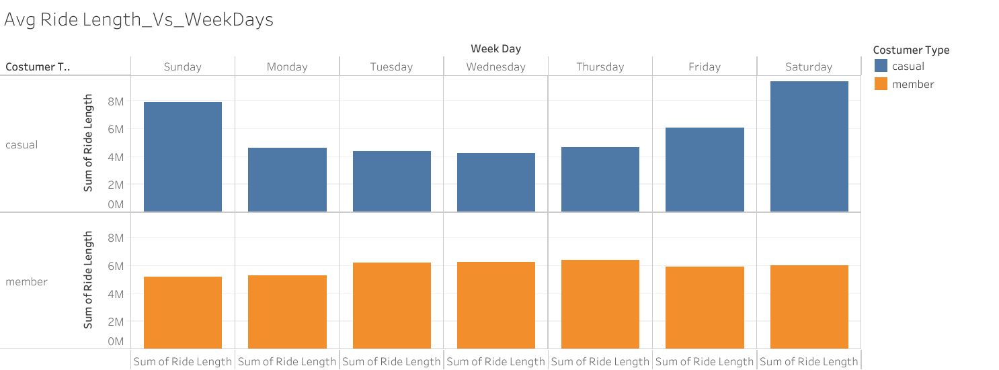

## 1. **Introduction**

Cyclistic, a bike share company based in Chicago, aims to enhance its marketing strategy and foster future growth by understanding user behavior. Assigned with a case study during the Google Data Analytics certification course, I am tasked with analyzing Cyclistic's historical bike trip data to provide actionable insights for the company's marketing strategy.

## 2. **Scenario**
With over 5,800 bicycles and 600 docking stations across the city, Cyclistic targets both casual riders and annual members. Lily Moreno, the Director of Marketing, seeks to convert casual riders into annual members through targeted marketing campaigns. Understanding the behavior and preferences of these user groups is crucial. Cyclistic's marketing analytics team is entrusted with analyzing past user data to identify trends and habits, ultimately aiding in crafting effective marketing strategies.

# 3. **Phase 1: Ask** 
## 3.0.1 Business Objective
The objective is to identify opportunities for targeted marketing campaigns to convert casual riders into annual members, thereby increasing profitability and driving growth.

## 3.0.2 Business Task
Tasks include analyzing historical bike trip data, identifying usage trends between casual and member riders, and leveraging insights to develop targeted marketing campaigns.

## 3.0.3 Stakeholders
Key stakeholders include Lily Moreno, Cyclistic's marketing team, casual riders, annual members, and investors/shareholders.

# 4. **Phase 2: Prepare**
## 4.0.1 Data Location
The data is obtained from Motivate International Inc. and includes 12 months of historical trip data from Cyclistic, accessible through a provided link.

## 4.0.2 Data Organization
Monthly CSV files from December 2021 to November 2022 constitute the dataset, featuring ride details such as ride ID, ridership type, ride time, and location information.

## 4.0.3 Data Credibility
Collected by Motivate, Inc., the data is comprehensive, consistent, and current. Identifying information has been removed to ensure user privacy.

## 4.0.4 Licensing, Privacy, Security, and Accessibility
The data is released under a specific license and is publicly accessible. Privacy measures have been taken to safeguard user information.

## 4.0.5 Ability of Data to Answer Business Questions
The dataset sufficiently addresses the business questions regarding usage patterns between annual members and casual riders.

## 4.0.6 Challenges with the Data
Challenges included data cleaning, handling large data volume, and utilizing specialized tools like R and Tableau for analysis.

# 5. **Phase 3: Data Process**
## 5.0.1 Choice of Tools
RStudio Desktop and Tableau were chosen for efficient data preparation, processing, analysis, and visualization due to their capabilities and handling of large datasets.

## 5.0.2 Data Review
An initial review assessed variables, data format, integrity, and potential issues, leading to the consolidation of 12 monthly files into one dataset. Identified anomalies were addressed to ensure data quality.

## install packages
```{r eval=FALSE}
#----------------------------------------------------------------------------------#  
install.packages("tidyverse")
install.packages("lubridate")
install.packages("janitor")
install.packages("data.table")
install.packages("readr")
install.packages("psych")
install.packages("hrbrthemes")
install.packages("ggplot2")
#----------------------------------------------------------------------------------#
```

## load packages
```{r eval=FALSE}
#----------------------------------------------------------------------------------#
library(tidyverse)
library(lubridate)
library(janitor)
library(data.table)
library(readr)
library(psych)
library(hrbrthemes)
library(ggplot2)
#----------------------------------------------------------------------------------#
```

## import data
```{r eval=FALSE}
#----------------------------------------------------------------------------------#
january_2023 <- read.csv("data/202301-divvy-tripdata.csv")
february_2023 <- read.csv("data/202302-divvy-tripdata.csv")
march_2023 <- read.csv("data/202303-divvy-tripdata.csv")
april_2023 <- read.csv("data/202304-divvy-tripdata.csv")
may_2023 <- read.csv("data/202305-divvy-tripdata.csv")
june_2023 <- read.csv("data/202306-divvy-tripdata.csv")
july_2023 <- read.csv("data/202307-divvy-tripdata.csv")
august_2023 <- read.csv("data/202308-divvy-tripdata.csv")
september_2023 <- read.csv("data/202309-divvy-tripdata.csv")
october_2023 <- read.csv("data/202310-divvy-tripdata.csv")
november_2023 <- read.csv("data/202311-divvy-tripdata.csv")
december_2023 <- read.csv("data/202312-divvy-tripdata.csv")
#----------------------------------------------------------------------------------#
```

## data validation
```{r eval=FALSE}
#----------------------------------------------------------------------------------#
colnames(january_2023)
colnames(february_2023)
colnames(march_2023)
colnames(april_2023)
colnames(may_2023)
colnames(june_2023)
colnames(july_2023)
colnames(august_2023)
colnames(september_2023)
colnames(october_2023)
colnames(november_2023)
colnames(december_2023)
#----------------------------------------------------------------------------------#
```

## total number of rows
```{r eval=FALSE}
#----------------------------------------------------------------------------------#
sum(nrow(january_2023) + nrow(february_2023) + nrow(march_2023) + 
  nrow(april_2023) + nrow(may_2023) + nrow(june_2023) + nrow(july_2023)+
  nrow(august_2023) + nrow(september_2023) + nrow(october_2023) + 
  nrow(november_2023) + nrow(december_2023))
#----------------------------------------------------------------------------------#
```

## combine data of 12 month into one for smooth work flow
```{r eval=FALSE}
#----------------------------------------------------------------------------------#
tripfinal <- rbind(january_2023, february_2023, march_2023, april_2023,
                   may_2023, june_2023, july_2023, august_2023, september_2023,
                   october_2023,november_2023,december_2023)
#----------------------------------------------------------------------------------#
```

## save the combined files
```{r eval=FALSE}
#----------------------------------------------------------------------------------#
write.csv(tripfinal, file = "data/tripfinal.csv", row.names = FALSE)
#----------------------------------------------------------------------------------#
```

## final data validation
```{r eval=FALSE}
#----------------------------------------------------------------------------------#
str(tripfinal)
View(head(tripfinal))
View(tail(tripfinal))
dim(tripfinal)
summary(tripfinal)
names(tripfinal)
#----------------------------------------------------------------------------------#
```

# 6. **Phase 4: Data Cleaning**
During this phase, I conducted data cleaning procedures to rectify errors or inconsistencies within the dataset. These procedures encompassed various techniques, including rectifying data entry errors, eliminating duplicates or erroneous records, and standardizing data formats to ensure compatibility with analysis tools. Data cleaning is pivotal in ensuring the accuracy and reliability of the data, thereby yielding meaningful and actionable insights.

Prior to commencing the data cleaning process, it was imperative to assess the total number of rows containing missing or "NA" values. This assessment provided insights into the extent of missing or incomplete data, guiding decisions on how to address these values, whether through elimination from the dataset or imputation with estimates or substitute values.

## count rows with "na" values
```{r eval=FALSE}
#----------------------------------------------------------------------------------#
colSums(is.na(tripfinal))
#----------------------------------------------------------------------------------#
```

## remove missing 
```{r eval=FALSE}
#----------------------------------------------------------------------------------#
clean_trip_final <- tripfinal[complete.cases(tripfinal), ]
#----------------------------------------------------------------------------------#
```

## remove duplicates
```{r eval=FALSE}
#----------------------------------------------------------------------------------#
clean_trip_final <- distinct(clean_trip_final)
#----------------------------------------------------------------------------------#
```

## remove "na"
```{r eval=FALSE}
#----------------------------------------------------------------------------------#
clean_trip_final <- drop_na(clean_trip_final)
clean_trip_final <- remove_empty(clean_trip_final)
clean_trip_final <- remove_missing(clean_trip_final)
#----------------------------------------------------------------------------------#
```

## remove data which greater start_at then end_at
```{r eval=FALSE}
#----------------------------------------------------------------------------------#
clean_trip_final <- clean_trip_final %>%
  filter(started_at < ended_at)
#----------------------------------------------------------------------------------#
```

## remaining column for better context
```{r eval=FALSE}
#----------------------------------------------------------------------------------#
clean_trip_final <- rename(clean_trip_final, costumer_type = member_casual,
                           bike_type = rideable_type)
#----------------------------------------------------------------------------------#
```

## separate date in date, month, year for better analysis
```{r eval=FALSE}
#----------------------------------------------------------------------------------#
clean_trip_final$date <- as.Date(clean_trip_final$started_at)
clean_trip_final$week_day <- format(as.Date(clean_trip_final$date), "%A")
clean_trip_final$month <- format(as.Date(clean_trip_final$date), "%b_%y")
clean_trip_final$year <- format(clean_trip_final$date, "%Y")
#----------------------------------------------------------------------------------#
```


## separate column for time 
```{r eval=FALSE}
#----------------------------------------------------------------------------------#
clean_trip_final$time <- as.POSIXct(clean_trip_final$started_at , format = "%Y-%m-%d %H:%M:%S")  
clean_trip_final$time <- format(clean_trip_final$time, format = "%H:%M")
#----------------------------------------------------------------------------------#
```

## add right length column
```{r eval=FALSE}
#----------------------------------------------------------------------------------#
clean_trip_final$ride_length <- difftime(clean_trip_final$ended_at, clean_trip_final$started_at, units = "mins")
#----------------------------------------------------------------------------------#
```

## select the data we are going to use
```{r eval=FALSE}
#----------------------------------------------------------------------------------#
clean_trip_final <- clean_trip_final %>%
  select(bike_type, costumer_type, month, year, time, started_at, week_day, ride_length)
#----------------------------------------------------------------------------------#
```

## remove stolen bikes
```{r eval=FALSE}
#----------------------------------------------------------------------------------#
clean_trip_final <- clean_trip_final[!clean_trip_final$ride_length>1440,]
clean_trip_final <- clean_trip_final[!clean_trip_final$ride_length<5,]
#----------------------------------------------------------------------------------#
```

## checked cleaned data
```{r eval=FALSE}
#----------------------------------------------------------------------------------#
colSums(is.na(clean_trip_final))
View(filter(clean_trip_final, clean_trip_final$started_at > clean_trip_final$ended_at))
View(filter(clean_trip_final, clean_trip_final$ride_length>1440 | clean_trip_final < 5))
#----------------------------------------------------------------------------------#
```

## save the cleaned data
```{r eval=FALSE}
#----------------------------------------------------------------------------------#
write.csv(clean_trip_final, file = "clean_trip_final.csv", row.names = FALSE)
#----------------------------------------------------------------------------------#
```


# 7. **Phase 5: Data Analysis**
In the Data Analysis phase, I delved into the dataset to uncover its underlying characteristics and patterns. Utilizing various visualizations such as charts and graphs, I sought to visualize the data and discern trends effectively. Additionally, employing statistical techniques like regression analysis, I aimed to uncover relationships between different variables within the dataset. Through this analysis, I extracted valuable insights and knowledge that could guide strategic business decisions.

To kickstart the analysis phase, I imported the meticulously cleaned and prepared trip data into my analysis software. Subsequently, I rigorously validated the data to ensure its accuracy and reliability, laying a robust foundation for subsequent analysis.

## import the cleaned data
```{r eval=FALSE}
#----------------------------------------------------------------------------------#
clean_trip_final <- read.csv("clean_trip_final.csv")
str(clean_trip_final)
names(clean_trip_final)
#----------------------------------------------------------------------------------#
```

## order the data
```{r eval=FALSE}
#----------------------------------------------------------------------------------#
clean_trip_final$month <- ordered(clean_trip_final$month,levels=c("Jan_23","Feb_23","Mar_23", 
                                                                  "Apr_23","May_23","Jun_23","Jul_23", 
                                                                  "Aug_23","Sep_23","Oct_23","Nov_23","Dec_23"))

clean_trip_final$week_day <- ordered(clean_trip_final$week_day,levels=c("Sunday", "Monday", "Tuesday", "Wednesday", "Thursday", "Friday", "Saturday"))
#----------------------------------------------------------------------------------#
```

## analysis:- min, max, median, average
```{r eval=FALSE}
#----------------------------------------------------------------------------------#
View(describe(clean_trip_final, fast=TRUE))
#----------------------------------------------------------------------------------#
```

## total number of customer
```{r eval=FALSE}
#----------------------------------------------------------------------------------#
View(table(clean_trip_final$costumer_type))
#----------------------------------------------------------------------------------#
```

## total rides for each customer type in minutes
```{r eval=FALSE}
#----------------------------------------------------------------------------------#
View(setNames(aggregate(ride_length ~ costumer_type, clean_trip_final, sum ),c("Customer_type", "total_ride_len(mins)")))
#----------------------------------------------------------------------------------#
```
  
## difference between members and casual riders in terms of length of ride
```{r eval=FALSE}
#----------------------------------------------------------------------------------#
View(clean_trip_final %>% 
       group_by(costumer_type) %>% 
       summarise(min_length_mins = min(ride_length), max_length_min = max(ride_length),
                 median_length_mins = median(ride_length), mean_length_min = mean(ride_length)))
#----------------------------------------------------------------------------------#
```

## average ride_length for users by day_of_week and numbers of total riders by day_of_week
```{r eval=FALSE}
#----------------------------------------------------------------------------------#
View(clean_trip_final %>%
       group_by(week_day) %>%
       summarise(Avg_length = mean(ride_length),
                 number_of_ride = n()))
#----------------------------------------------------------------------------------#
```

## average ride length comparison by each week day according to each customer type
```{r eval=FALSE}
#----------------------------------------------------------------------------------#
View(aggregate(clean_trip_final$ride_length ~ clean_trip_final$costumer_type+
                 clean_trip_final$week_day, FUN = mean))
#----------------------------------------------------------------------------------#
```

## analyze rider length data by customer type and weekday
```{r eval=FALSE}
#----------------------------------------------------------------------------------#
View(clean_trip_final %>% 
       group_by(costumer_type, week_day) %>% 
       summarise(number_of_ride = n(),
                 avgerage_duration = mean(ride_length),
                 median_duration = median(ride_length),
                 max_duration = max(ride_length),
                 min_duration = min(ride_length)))
#----------------------------------------------------------------------------------#
```

## save the data for data visualization
```{r eval=FALSE}
#----------------------------------------------------------------------------------#
write.csv(clean_trip_final,file = "clean_trip_final_tableau.csv",row.names = FALSE)
#----------------------------------------------------------------------------------#
```

# 8. **Phase 6: Data Visualizations and Summary**

## 8.0.1 Visualization 1
The visualization illustrates the total number of rides per day of the week for each customer type. Casual riders exhibit higher ride numbers on weekends, suggesting leisurely use, while members maintain consistent ride numbers throughout the week, possibly indicating commute-related usage.


## 8.0.2 Visualization 2
This plot depicts usage patterns during rush hours, revealing that annual members utilize bikes for commuting, while casual riders show steady usage throughout the day, peaking in the evening. These distinct patterns inform targeted marketing strategies.


## 8.0.3 Visualization 3
Monthly usage trends indicate higher demand in summer, especially among casual riders. Annual members sustain consistent usage, potentially for commuting, highlighting seasonal variations between the user groups.

{width="716"}

## 8.0.4 Visualization 4
Analysis of ride duration by weekdays reveals casual riders' weekend preference for leisure, contrasting with members' consistent usage. This insight aids in marketing segmentation and pricing strategies.



## 8.0.5 Visualization 5
Overall, annual members prioritize commuting, maintaining steady usage, while casual riders favor weekend leisure activities, leading to longer average ride durations. These findings inform business strategies and service improvements.


## 8.0.6 Visualization 6
Members prefer classic bikes, while casual riders exhibit a diverse preference, leaning slightly towards electric and docked bikes. Understanding bike type preferences informs fleet management and service optimization.


## 8.0.7 Visualization 7
Classic bikes dominate both user groups' preferences, with annual members showing a stronger preference. This underscores the importance of maintaining a reliable classic bike fleet and aligning marketing efforts accordingly.


# 9. **Phase 7: Act**
## 9.0.1 Key Takeaways:
- Annual members primarily commute, while casual riders prioritize weekend leisure.
- Consistent member usage contrasts with casual riders' seasonal variations.
- Classic bikes are favored by both groups, necessitating fleet enhancements.
- Casual riders exhibit longer ride durations, signaling potential service adjustments.

# 9.0.2 **Recommendations**
- Target leisure riders with summer weekend promotions to boost revenue.
- Incentivize regular member usage through discounts and perks.
- Investigate reasons for docked bike unpopularity and consider improvements.
- Enhance classic bike offerings based on user preferences.
- Offer extended rental options for casual riders to capitalize on longer rides.
- Ramp up winter marketing for casual riders to mitigate seasonal fluctuations.

